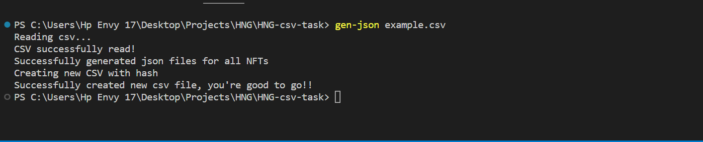

# HNG9 CSV to CHIP-0007 formatter

## Overview

The cli program generates a json file in the CHIP-0007 format for each team in the csv file.

It generates a folder called NFTs or NFTs(i) (where i is an integer greater than 0) and creates subfolders within it for each of the teams. Each subfolder contains the json files for the NFTs of the associated team.

Once the JSON files are created, a new csv is created with an additional column for the hashes of each NFT

This CLI app was written in NodeJs


## Getting Started

To use this cli app, you should already have NodeJS installed. If you don't checkout [Nodejs](https://nodejs.org/en/download/)

### Installation

Clone the repository via

```bash
git clone https://github.com/Ayo-Awe/HNG-csv-task.git
```

Install package dependencies

```bash
npm install
```

Alternatively,

```bash
npm install -g .
```

This allow you to run the script from anywhere on your machine

### Usage



**command**: gen-json

**parameters**: filename

If you've installed the package globally, you can run the application via

```bash
gen-json csvfile.csv
```

Otherwise, use npx as shown below

```bash
npx gen-json csvfile.csv
```

**Note**: your file doesn't need to be named csvfile.csv
